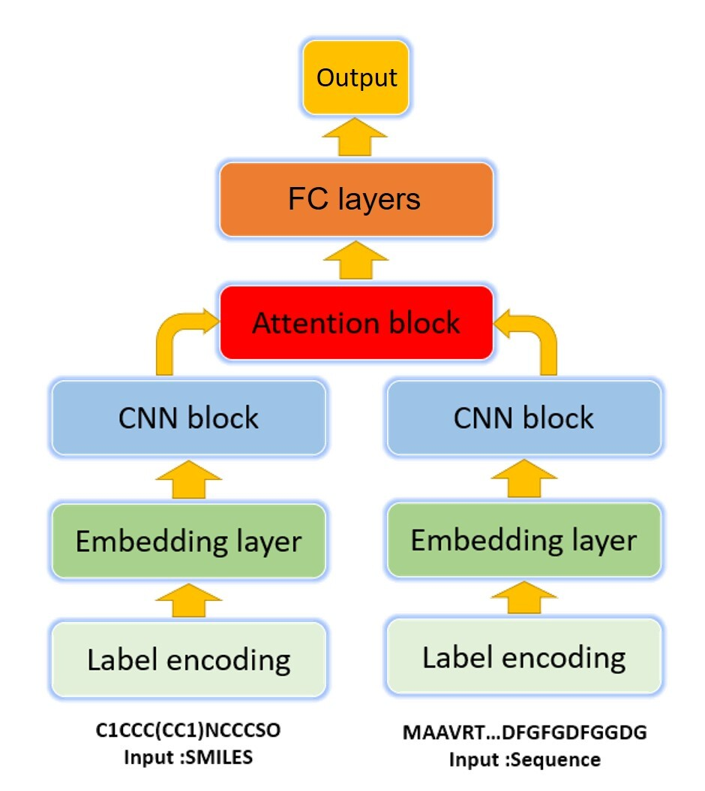

# AttentionDTA_BIBM
 AttentionDTA: prediction of drug–target binding affinity using attention model.https://ieeexplore.ieee.org/abstract/document/8983125

This repository contains the source code and the data.

## AttentionDTA

## Setup and dependencies 

Dependencies:
- python 3.6
- tensorflow >=1.9
- numpy

## Resources:
+ README.md: this file.
+ tfrecord: The original data set and data set processing code are saved in this folder.
	+ davis_div.txt: Under the 5-fold cross-validation setting, there is a division of the training set and the test set of the davis dataset.
	+ kiba_div.txt: Under the 5-fold cross-validation setting, there is a division of the training set and the test set of the kiba dataset.
	+ davis_str_all.txt
	+ kiba_str_all.txt
	+ dataset.py: create data in tfrecord format according to (kiba/davis)_div.txt
+ DTA_train.py: train a AttentionDTA model.
+ DTA_model.py: AttentionDTA model architecture
+ DTA_test.py: test trained models

# Step-by-step running:

## 1. Create data in tfrecord format
python dataset.py

## 2. Train a prediction model
python DTA_train.py
To train a model using training data. 

## 3. Predict affinity with trained models
python DTA_test.py